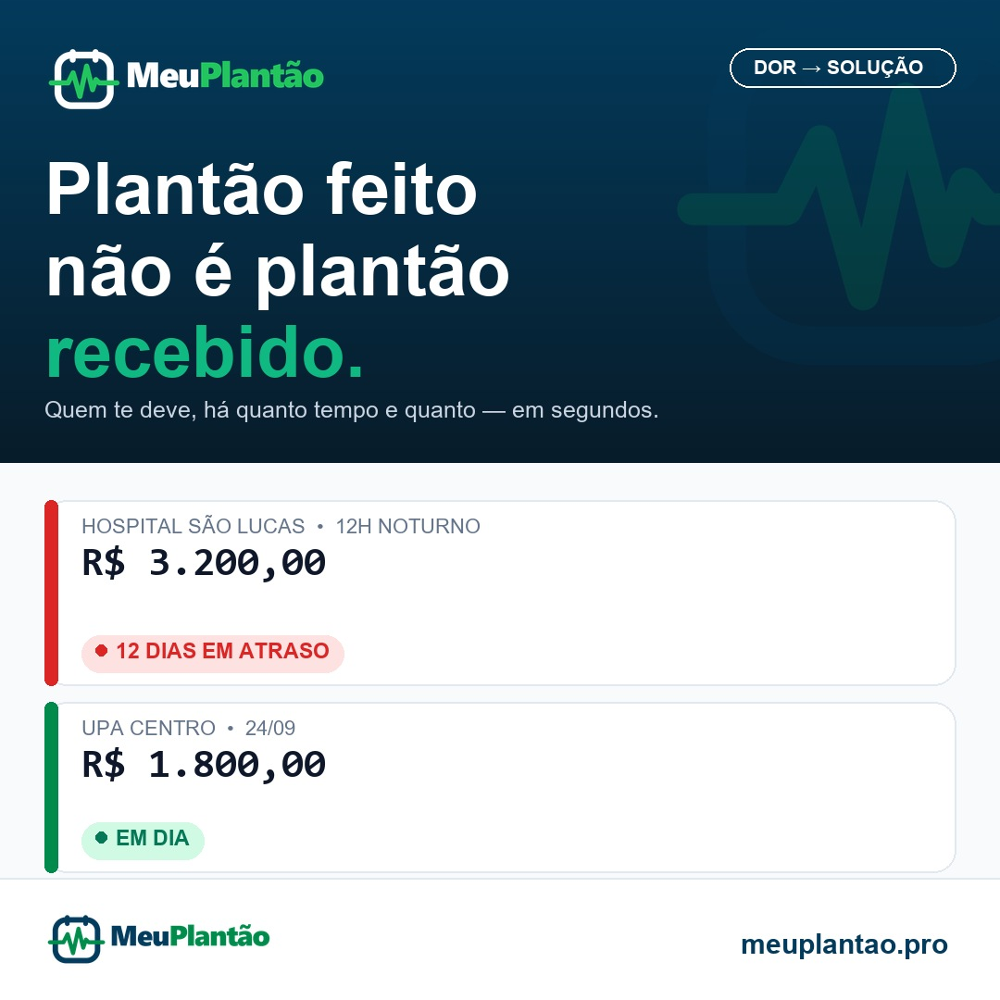

# Post Instagram — MeuPlantão (@meuplantao.pro)
**Demanda:** [MAI-113](https://linear.app/maickagent/issue/MAI-113/mktinstagram-criar-post-sobre-controle-de-repasses-em-atraso-de)
**Tema:** Controle de repasses em atraso de plantões (quem deve, há quanto tempo, quanto)
**Público-alvo:** Profissionais de saúde plantonistas com múltiplos vínculos (hospitais, UPAs, clínicas)
**Pilar:** Dor → Solução
**Formato:** Feed Instagram (1:1 Quadrado - 1080x1080)

---

## 1. Visual do Criativo



### Especificações da Arte (v3 final — logo oficial):
- **Formato:** Imagem quadrada (1080 × 1080 px, proporção 1:1, JPG alta nitidez)
- **Headline na Arte (aprovada, mantida):** *"Plantão feito não é plantão recebido."*
- **Logos oficiais usados diretamente do repo (PNG transparente HD):**
  - Topo (nítido sobre dark): `public/brand/meuplantao-logo-oficial-white.png` (1020x270)
  - Rodapé (nítido sobre branco): `public/brand/meuplantao-logo-oficial-horizontal.png` (1020x270)
  - Marca d'água: `public/brand/meuplantao-simbolo-oficial.png` (512x512) a ~20% de opacidade no hero (15–25% conforme diretriz)
- **Paleta oficial do app:**
  - Hero dark: gradiente `#033B5C → #081C2A` (azul institucional)
  - Primária: `#008A4B` / `#10B981` (verde esmeralda cirúrgico)
  - Status: `#EF4444` (atrasado) / esmeralda (em dia)
  - Fundo: `#F8FAFB` ultra-clean / Texto `#0F172A` / Muted `#64748B`
- **Tipografia fiel ao app:** Headline extrabold, valores em mono tabular, badges pill rounded-full uppercase
- **Arquivo salvo no repositório:** `docs/marketing/assets/mai-113-repasses-em-atraso.jpg` (substituído na v3)
- **Composição:** Hero dark com headline + 2 cards brancos rounded-2xl border `#E2E8F0` idênticos ao dashboard + rodapé branco com logo oficial colorido + meuplantao.pro

### Variações de Headline (para escolha do Maick):
- **H1 (usada na arte):** Plantão feito não é plantão recebido.
- **H2:** Quanto do seu dinheiro está preso em repasse atrasado?
- **H3:** Quem te deve, há quanto tempo, e quanto?

---

## 2. Copywriting da Publicação

### Ganchos (para escolha do Maick):
- **G1 (recomendado):** Você sabe quanto te devem em repasses atrasados — agora, sem olhar planilha?
- **G2 (alternativo):** Se um repasse atrasasse hoje, em quanto tempo você perceberia?

### Legenda Completa (com G1):
```text
Você sabe quanto te devem em repasses atrasados — agora, sem olhar planilha?

Quem bate plantão em 2, 3 hospitais diferentes conhece a rotina:
sai de uma escala, entra em outra, troca de horário em cima da hora, e o pagamento cai picado, em datas diferentes.

Aí o controle fica no grupo de WhatsApp com você mesmo, num print solto ou numa planilha que ninguém atualiza.

O resultado é sempre o mesmo:
- Repasse atrasado que passa despercebido
- Pagamento parcial que ninguém confere
- Descanso virando conferência de extrato

Você não fez faculdade e residência pra ficar cobrando repasse no WhatsApp depois de 24h acordado.

O MeuPlantão foi feito pra essa realidade:
📱 Registro do plantão em segundos no celular
💰 Saldo real calculado na hora, sem conta manual
⚠️ Visão clara de quem está em dia e quem está em atraso

Plantão feito precisa ser plantão recebido. Sem deixar dinheiro pra trás.

👉 Comece a organizar hoje: link na bio (@meuplantao.pro) ou acesse meuplantao.pro
Marca aquele colega que vive de plantão e precisa ver isso.
```

### Hashtags Estratégicas:
```text
#plantaomedico #vidademedico #medicosdobrasil #escalamedica #plantonista #residente #medicina #hospital #prontosocorro #emergenciamedica #enfermagem #fisioterapia #gestaofinanceira #financaspessoais #organizacaofinanceira #saudefinanceira #meuplantao #repasses
```

---

## 3. Preparação para Agendamento via Postiz

### Detalhes de Agendamento Recomendados:
- **Plataforma:** Instagram (Feed)
- **Melhores Horários:**
  - Almoço: 12h15 às 12h45 (pausa entre atendimentos)
  - Noite: 20h00 às 21h15 (transição/fim de plantão)
- **Dias sugeridos:** Terça ou Quarta-feira (pico de engajamento para conteúdo profissional)

### Payload JSON para API / Importação no Postiz:

```json
{
  "post": {
    "type": "post",
    "providers": ["instagram"],
    "scheduledAt": "2026-09-23T15:30:00.000Z",
    "content": "Você sabe quanto te devem em repasses atrasados — agora, sem olhar planilha?\n\nQuem bate plantão em 2, 3 hospitais diferentes conhece a rotina:\nsai de uma escala, entra em outra, troca de horário em cima da hora, e o pagamento cai picado, em datas diferentes.\n\nAí o controle fica no grupo de WhatsApp com você mesmo, num print solto ou numa planilha que ninguém atualiza.\n\nO resultado é sempre o mesmo:\n• Repasse atrasado que passa despercebido\n• Pagamento parcial que ninguém confere\n• Descanso virando conferência de extrato\n\nVocê não fez faculdade e residência pra ficar cobrando repasse no WhatsApp depois de 24h acordado.\n\nO MeuPlantão foi feito pra essa realidade:\n📱 Registro do plantão em segundos no celular\n💰 Saldo real calculado na hora, sem conta manual\n⚠️ Visão clara de quem está em dia e quem está em atraso\n\nPlantão feito precisa ser plantão recebido. Sem deixar dinheiro pra trás.\n\n👉 Comece a organizar hoje: link na bio (@meuplantao.pro) ou acesse meuplantao.pro\nMarca aquele colega que vive de plantão e precisa ver isso.\n\n.\n.\n.\n#plantaomedico #vidademedico #medicosdobrasil #escalamedica #plantonista #residente #medicina #hospital #prontosocorro #emergenciamedica #enfermagem #fisioterapia #gestaofinanceira #financaspessoais #organizacaofinanceira #saudefinanceira #meuplantao #repasses",
    "media": [
      {
        "path": "docs/marketing/assets/mai-113-repasses-em-atraso.jpg",
        "altText": "Plantão feito não é plantão recebido. Comparativo de cards com status atrasado e em dia no app MeuPlantão"
      }
    ],
    "settings": {
      "instagram": {
        "postType": "feed"
      }
    }
  }
}
```

---

## Self-check (marketing-copywriter)
- [x] Tom de voz confere com marketing-config (colega de plantão, direto, sem vendedor agressivo)
- [x] Tem CTA (link na bio + marca colega)
- [x] Primeira linha é hook
- [x] Sem claims proibidos (ferramenta de controle, sem promessa de rendimento)
- [x] Tamanho adequado para Instagram feed
