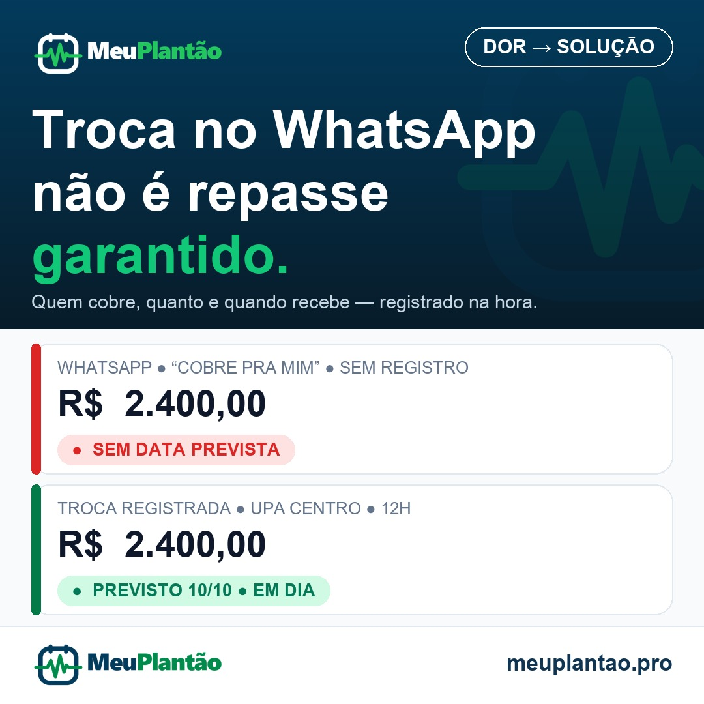

# Post Instagram — MeuPlantão (@meuplantao.pro)
**Demanda:** [MAI-116](https://linear.app/maickagent/issue/MAI-116/mktinstagram-post-sobre-perdas-financeiras-em-trocas-de-plantao-no)
**Tema:** A armadilha da troca de plantão no WhatsApp e o sumiço do repasse
**Público-alvo:** Profissionais de saúde plantonistas que combinam trocas e dobras informalmente no WhatsApp
**Pilar:** Dor → Solução
**Formato:** Feed Instagram (1:1 Quadrado - 1080x1080)
**Agendamento alvo (Postiz):** Sábado, 19/09/2026 às 13:20 (Brasília) — `2026-09-19T16:20:00.000Z`

---

## 1. Visual do Criativo



### Especificações da Arte (logo oficial):
- **Formato:** Imagem quadrada (1080 × 1080 px, proporção 1:1, JPG alta nitidez)
- **Headline na Arte (aprovada):** *"Troca no WhatsApp não é repasse garantido."*
- **Sub-headline:** *"Quem cobre, quanto e quando recebe — registrado na hora."*
- **Logos oficiais usados diretamente do repo (PNG transparente HD):**
  - Topo (nítido sobre dark): `public/brand/meuplantao-logo-oficial-white.png` (1020x270)
  - Rodapé (nítido sobre branco): `public/brand/meuplantao-logo-oficial-horizontal.png` (1020x270)
  - Marca dágua: `public/brand/meuplantao-simbolo-oficial.png` (512x512) a ~16% de opacidade no hero
- **Paleta oficial do app:**
  - Hero dark: gradiente `#033B5C → #081C2A` (azul institucional)
  - Destaque: `#10C878` (verde esmeralda cirúrgico)
  - Status: `#DC2626` (sem data prevista) / `#047857` (em dia)
  - Fundo: `#F8FAFB` ultra-clean / Texto `#0F172A` / Muted `#64748B`
- **Tipografia fiel ao app:** Headline extrabold, valores em bold tabular, badges pill rounded-full uppercase
- **Arquivo salvo no repositório:** `docs/marketing/assets/mai-116-troca-plantao.jpg`
- **Composição:** Hero dark com headline + 2 cards brancos rounded-2xl border `#E2E8F0` idênticos ao dashboard (WhatsApp sem registro vs. troca registrada) + rodapé branco com logo oficial colorido + meuplantao.pro

### Variações de Headline (para escolha do Maick):
- **H1 (usada na arte):** Troca no WhatsApp não é repasse garantido.
- **H2:** "Cobre pra mim que te pago dia 10" — e o dia 10 nunca chega.
- **H3:** Quem cobre seu plantão, quanto te deve e quando paga?

---

## 2. Copywriting da Publicação

### Ganchos (para escolha do Maick):
- **G1 (recomendado):** "Cobre pra mim que te pago dia 10" — e o dia 10 nunca chega?
- **G2 (alternativo):** Quantas trocas de plantão você já combinou no WhatsApp e nunca recebeu?

### Legenda Completa (com G1):
```text
"Cobre pra mim que te pago dia 10" — e o dia 10 nunca chega?

Fim de semana, escala furada, colega pedindo pra cobrir no WhatsApp. Você dobra, cobre, salva a escala — e o combinado se perde no meio de 200 mensagens.

Sem vincular a troca ao responsável, ao valor e à data prevista, o resultado é sempre o mesmo:
- Repasse da troca que some no esquecimento
- "Te pago dia 10" sem dia certo, sem valor, sem cobrança
- Cobrança constrangedora semanas depois, sem prova do combinado

Você não dobrou o plantão pra virar cobrador de colega depois de 24h acordado.

O MeuPlantão resolve isso na hora:
📱 Registro da troca em segundos no celular
💰 Saldo real calculado na hora, sem conta manual
⚠️ Visão clara de quem está em dia e quem está em atraso

Troca feita precisa ser troca recebida. Sem deixar dinheiro pra trás.

👉 Comece a organizar hoje: link na bio (@meuplantao.pro) ou acesse meuplantao.pro
Marca aquele colega que vive trocando plantão no WhatsApp e precisa ver isso.
```

### Hashtags Estratégicas:
```text
#plantaomedico #vidademedico #medicosdobrasil #escalamedica #plantonista #trocadeplantao #residente #medicina #hospital #prontosocorro #emergenciamedica #enfermagem #gestaofinanceira #financaspessoais #organizacaofinanceira #saudefinanceira #meuplantao #repasses
```

---

## 3. Preparação para Agendamento via Postiz

### Detalhes de Agendamento Recomendados:
- **Plataforma:** Instagram (Feed)
- **Agendamento alvo:** Sábado, 19/09/2026 às 13:20 (Brasília) — `2026-09-19T16:20:00.000Z`
- **Horário alternativo:** 20h00 às 21h15 (transição/fim de plantão)

### Payload JSON para API / Importação no Postiz:

```json
{
  "post": {
    "type": "post",
    "providers": ["instagram"],
    "scheduledAt": "2026-09-19T16:20:00.000Z",
    "content": "\"Cobre pra mim que te pago dia 10\" — e o dia 10 nunca chega?\n\nFim de semana, escala furada, colega pedindo pra cobrir no WhatsApp. Você dobra, cobre, salva a escala — e o combinado se perde no meio de 200 mensagens.\n\nSem vincular a troca ao responsável, ao valor e à data prevista, o resultado é sempre o mesmo:\n• Repasse da troca que some no esquecimento\n• \"Te pago dia 10\" sem dia certo, sem valor, sem cobrança\n• Cobrança constrangedora semanas depois, sem prova do combinado\n\nVocê não dobrou o plantão pra virar cobrador de colega depois de 24h acordado.\n\nO MeuPlantão resolve isso na hora:\n📱 Registro da troca em segundos no celular\n💰 Saldo real calculado na hora, sem conta manual\n⚠️ Visão clara de quem está em dia e quem está em atraso\n\nTroca feita precisa ser troca recebida. Sem deixar dinheiro pra trás.\n\n👉 Comece a organizar hoje: link na bio (@meuplantao.pro) ou acesse meuplantao.pro\nMarca aquele colega que vive trocando plantão no WhatsApp e precisa ver isso.\n\n.\n.\n.\n#plantaomedico #vidademedico #medicosdobrasil #escalamedica #plantonista #trocadeplantao #residente #medicina #hospital #prontosocorro #emergenciamedica #enfermagem #gestaofinanceira #financaspessoais #organizacaofinanceira #saudefinanceira #meuplantao #repasses",
    "media": [
      {
        "path": "docs/marketing/assets/mai-116-troca-plantao.jpg",
        "altText": "Troca no WhatsApp não é repasse garantido. Comparativo entre troca combinada no WhatsApp sem data prevista e troca registrada no app MeuPlantão"
      }
    ],
    "settings": {
      "instagram": {
        "postType": "feed"
      }
    }
  }
}
```

---

## Self-check (marketing-copywriter)
- [x] Tom de voz confere com marketing-config (colega de plantão, direto, sem vendedor agressivo)
- [x] Tem CTA (link na bio + marca colega)
- [x] Primeira linha é hook
- [x] Sem claims proibidos (ferramenta de controle, sem promessa de rendimento)
- [x] Tamanho adequado para Instagram feed
